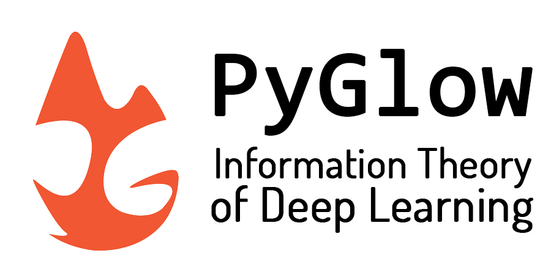

.. PyGlow documentation master file, created by
   sphinx-quickstart on Tue Sep 10 10:31:49 2019.
   You can adapt this file completely to your liking, but it should at least
   contain the root `toctree` directive.

Welcome to PyGlow's documentation!
==================================

PyGlow is a Python package which attempts to implement Keras like API struture on PyTorch backend. It provides functionalities which supports information theoretic methods in deep learning. These methods are relevant for understanding neural network dynamics in information plane. The package is equipped with a number of state-of-the-art algorithms for estimating and calculating various kinds of information theoretic measures. The package also provides intensive support for information bottleneck based methods in deep learning.

What's new with PyGlow ?
------------------------
PyGlow provide support for the following features of the 'IB theory of Deep Learning':

* Functionalities for experimental IB-based DNN analysis
* Test IB-based DNN performance bounds
* Flexible API structure to test theoretical ideas and hypothesis related to IB-theory or information theory in general
* IB-based training paradigms for DNN
* Flexible internal pipeline which allows for the implementation of custom user-defined dependence criterions or IB-based loss functions
 

Example
-------
Let's see a code snippet which tracks the input-hidden-label segment (called dynamics segment) for each batch of each epoch and calculates the HSIC criterion between each hidden layer, input and label of a dynamics segment which is for each layer of each batch of each epoch.

.. code-block:: python
  :linenos:
  
  # importing PyGlow modules
  import glow
  from glow.layers import Dense, Dropout, Conv2d, Flatten
  from glow.datasets import mnist, cifar10
  from glow.models import IBSequential
  from glow.information_bottleneck.estimator import HSIC
  
  # hyperparameter
  batch_size = 64
  num_workers = 3
  validation_split = 0.2
  num_epochs = 2

  # load the dataset
  train_loader, val_loader, test_loader = mnist.load_data(
      batch_size=batch_size, num_workers=num_workers, validation_split=validation_split
  )

  model = IBSequential(input_shape=(1, 28, 28), gpu=True, 
                                                track_dynamics=True, save_dynamics=True)
  model.add(Conv2d(filters=16, kernel_size=3, stride=1, padding=1, activation='relu'))
  model.add(Flatten())
  model.add(Dropout(0.4))
  model.add(Dense(500, activation='relu'))
  model.add(Dropout(0.4))
  model.add(Dense(200, activation='relu'))
  model.add(Dropout(0.2))
  model.add(Dense(10, activation='softmax'))

  # compile the model
  model.compile(optimizer='SGD', loss='cross_entropy', metrics=['accuracy'])

  # attach evaluator - Tracks the dynamics and calculate coordinates 
  model.attach_evaluator(HSIC(kernel='gaussian', gpu=True, sigma=5))

  # train the model along with calculating dynamics
  model.fit_generator(train_loader, val_loader, num_epochs)

That's it ! you can now extract the evaluated dynamics from the model. For complete code checkout this notebook_.

.. _notebook: https://github.com/spino17/PyGlow/blob/master/docs/source/examples/Analysing_dynamics_HS_Criterion.ipynb

You can find more example on either at :doc:`/jupyternotebooks` section or related notebooks in github repo at examples_.

.. _examples: https://github.com/spino17/PyGlow/tree/master/docs/source/examples

And yes the code structure looks exactly like Keras ! PyGlow closely follows the API structure of Keras and provides with an 'easy to implement' pipeline so that you can really work on your ideas rather than debugging ;)

Now that you have seen the exciting implications of PyGlow and with how much clean interface you can implement information theoretic methods for your own model,  just head over to install it on your local machine at :doc:`/gettingstarted` and get everything set up to really open the black box of deep learning !

Contents
--------

.. toctree::
   :maxdepth: 3
   
   gettingstarted
   userguide
   jupyternotebooks
   whatsnew
   license
